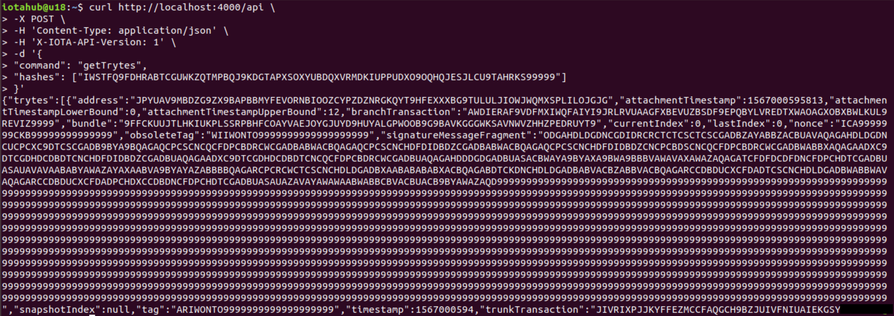

# Setting up Chronicle

**Here is a simple example of setting up Chronicle**

These instructions will get you a copy of the project up and running on your local machine for testing purposes.

## Prerequisites

- Independent running Scylla cluster using [ScyllaDB](https://docs.scylladb.com/getting-started/) version 3.0.6 or later

- [Elixir](https://elixir-lang.org/install.html) version 1.8.1 or later 

- [Phoenix](https://hexdocs.pm/phoenix/installation.html)

- [Bazel](https://docs.bazel.build/versions/master/install.html)


## Installing

### Configuring Chronicle
Clone the repo and open the folder 
```
git clone https://github.com/iotaledger/chronicle.git
cd chronicle
```

Open the core config.exs file
```
sudo nano apps/core/config/config.exs
```
Under __ DATA_CENTERS__, change the ip address from 127.0.0.1 to the IP address of your ScyllaDB

By default, Chronicle listens to unconfirmed transactions.  You can configure the Broker app to listen to confirmed transactions by adding your zmq node.  Open the broker config.exs file.
```
sudo nano apps/broker/config/config.exs
```

Under the ```config:broker __ TOPICS__, sn_trytes``` add your zmq address and port in this format: ```{'zmq.iota.org',5556}```

### Compiling Chronicle

Fetch the required dependencies
```
mix deps.get
```
Generate phoenix secret and then copy the 64-bytes secret string
```
mix phx.gen.secret
```

Compile the project
```
mix deps.compile
mix compile
```

### Running Chronicle

```
SECRET_KEY_BASE=theGenerated64-byteSecretString PORT=4000 HOST=localhost MIX_ENV=prod elixir --name app@hostname --cookie "MySecretChronicleCookie" -S mix run --no-compile --no-halt
```

If the host is localhost then name can be ```Chronicle@localhost```.
Otherwise, use your hostname.

The cookie should be a phrase that you keep secret


### Retrieving transaction data

getTrytes allows you to query the raw data in the message of a transaction
```
curl http://host:port/api \
-X POST \
-H 'Content-Type: application/json' \
-H 'X-IOTA-API-Version: 1' \
-d '{
"command": "getTrytes",
"hashes": [""]
}'
```


