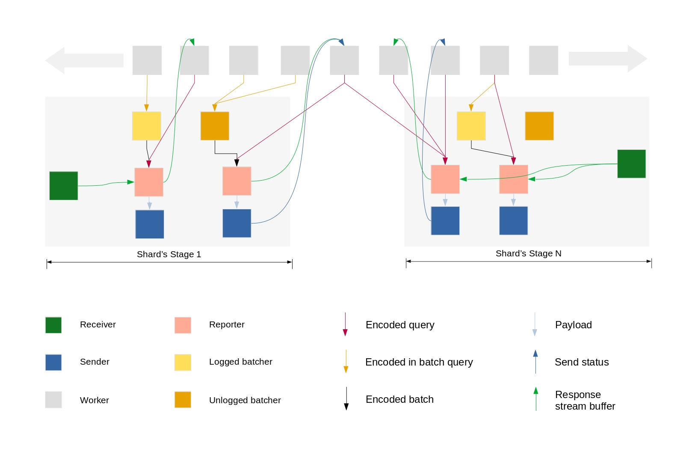

# Query engine

**The query engine allows users to get data from the database**

Due to the large size of a permanode, big data queries use batchers to look for data in shards. Shards are distinct collections of data. Batchers group data requests together so they run more efficiently.

#### How queries work

Data flows through these steps:

1. A request is sent by a sender and received by a receiver. A receiver controls an active socket for a given connection and a given shard.  

2. A worker creates the necessary queries for a request  

3. Reporters receive queries from workers

4. A batcher runs multiple requests at the same time

5. Batchers send responses to receivers

6. The receiver routes the response to the reporter 

7. Reporters send responses to workers

8. The worker handles the responses from the reporters and sends an acknowledgment to the sender  

9. A sender receives data from its reporter and sends it over a socket. It updates the worker and informs the reporter in case of failure.

#### Batchers

Multiple `INSERT`, `UPDATE` and `DELETE` statements can grouped into a single [BATCH statement]((https://docs.scylladb.com/getting-started/dml/#batch-statement)) such as the example below:

```
BEGIN BATCH
   INSERT INTO users (userid, password, name) VALUES ('user2', 'ch@ngem3b', 'second user');
   UPDATE users SET password = 'ps22dhds' WHERE userid = 'user3';
   INSERT INTO users (userid, password) VALUES ('user4', 'ch@ngem3c';
   DELETE name FROM users WHERE userid = 'user1';
APPLY BATCH;
```

This saves network round-trips between the client and the server or the server coordinator and the replicas. All updates in a `BATCH` statement belonging to a given partition key are performed in isolation.

There are three types of batches:

- **LOGGED (default):** Either all the changes are made, or none of the changes are made. This is called "batch atomicity".

- **UNLOGGED:** Batch atomicity takes extra resources when a batch spans multiple partitions. A particular batch may not require spending these extra resources. You can tell Scylla to skip logging the batch by using the UNLOGGED type. If a batch fails, then there is a risk that it may leave some changes undone.

- **COUNTER:** Used for batched counter updates. COUNTER updates are not idempotent.

The following diagram represents a data flow using the following configuration: 

```
__LOGGED_PER_SHARD__: 1
__UNLOGGED_PER_SHARD__: 1
__COUNTER_PER_SHARD__: nill
__REPORTER_PER_SHARD__: 2
__CONN_PER_SHARD__: 1
```

